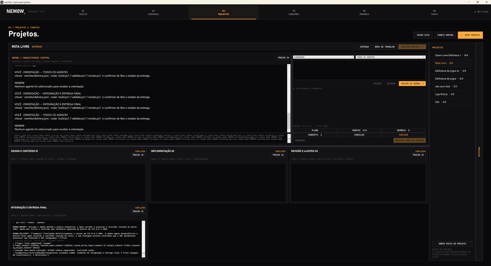

# 🖥️ nem0w / personal system

**Um espaço de trabalho Windows para coordenar agentes de programação com IA.**

[← Voltar ao perfil](https://github.com/nem0w) · [Portfólio](https://vitorcarvalho.dev) · [Contato](mailto:vitorcarvalhocarniato@gmail.com)

## 💡 A ideia

Coordenar vários agentes de programação envolve organizar tarefas, compartilhar contexto, separar alterações e revisar o resultado. Estou desenvolvendo o nem0w para reunir essas etapas em um aplicativo desktop para Windows.

## 🚀 Como funciona

1. **Planejar:** criar um projeto, definir tarefas e escolher agentes e modelos.
2. **Executar:** organizar os agentes em etapas e trabalhar em worktrees Git independentes.
3. **Acompanhar:** consultar a atividade, responder perguntas e recuperar trabalhos interrompidos.
4. **Integrar:** reunir as alterações em uma área de integração.
5. **Validar e revisar:** executar os scripts configurados de build, testes e verificação de abertura antes de aprovar a entrega na branch principal.

## 🤖 Dentro do aplicativo

- **Orquestrador central:** coordenação de tarefas e comunicação com a equipe.
- **Painéis de agentes:** estado, perguntas, entregas e consumo informado pelos provedores.
- **Worktrees Git:** separação das alterações durante o desenvolvimento.
- **Terminais interativos:** comandos em áreas de trabalho independentes.
- **Prévia e arquivos:** consulta de arquivos e visualização de projetos web compatíveis.
- **Revisão da entrega:** integração e resultados das verificações configuradas pelo projeto.

O nem0w oferece fluxos com Codex e Claude, escolha de modelos por agente e recuperação de sessões. Os recursos disponíveis dependem do CLI e do provedor. Terminais interativos trabalham em branches próprias; suas alterações não entram automaticamente na integração da equipe.

## 🛠️ Tecnologias

**C# · .NET 8 · WPF / XAML · Git · PowerShell · WebView2 · MCP · Windows ConPTY · xterm.js**

Com este projeto, estou aprofundando meu aprendizado em interfaces desktop, gerenciamento de processos, automação Git, persistência, recuperação de erros e coordenação de ferramentas de IA.

## 🌱 Estado do projeto

Projeto pessoal em desenvolvimento. Algumas funcionalidades recentes de interface e terminal ainda precisam de validação adicional em execução. A cobertura da validação depende dos scripts configurados em cada projeto.

O repositório do código-fonte permanece **privado**. Esta página é uma apresentação pública do aplicativo, sem disponibilização de código ou download.

A imagem mostra o aplicativo real. Ela ilustra a interface e não representa uma certificação de todas as funcionalidades ou provedores.

---

Desenvolvido por **Vitor Carvalho de Medeiros** · [Entre em contato](mailto:vitorcarvalhocarniato@gmail.com)
